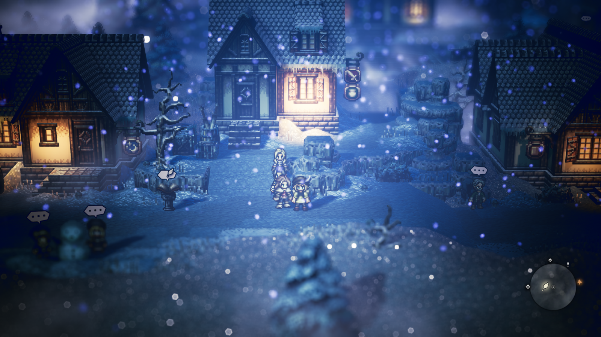

模仿八方旅人风格的HD2D效果实现

项目模板 SZU计算机图形学课程组

学习教程 LearnOpenGL

shader教程(模糊、景深) [3d-game-shaders-for-beginners](https://github.com/lettier/3d-game-shaders-for-beginners)

模型来源 3d model free、blockbench

2D的animation
